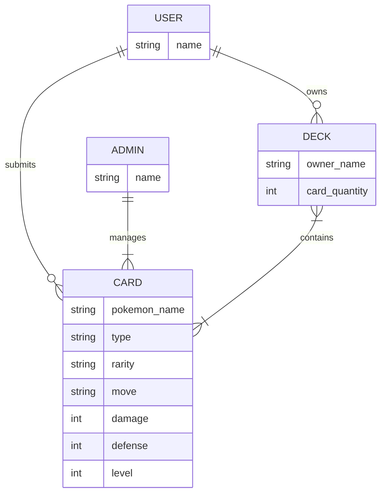
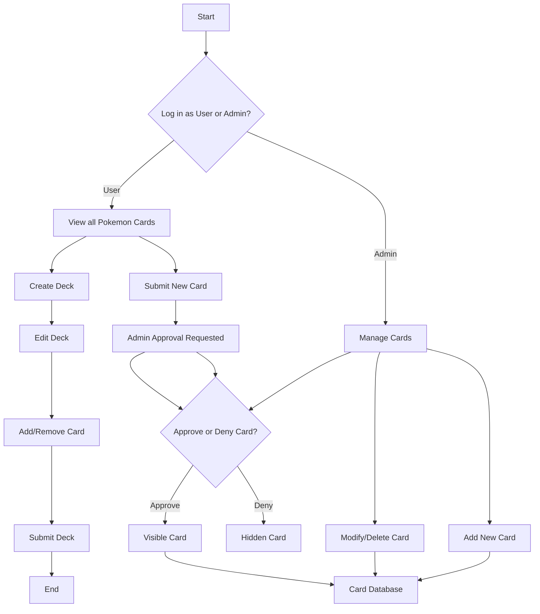

# Pokemon Card Storage Web App
## 1. Entity-Relationship Diagram (ERD)

---
## 2. User Flow Diagram

---
## 3. System Architecture Diagram
```mermaid
graph TD
A[User] --|HTTP Request| B[Frontend UI]
B --|API Request| C[Backend API]
C --|Data Query/Update| D[(Database)]
E[Admin] --|HTTP Request| F[Admin Dashboard]
F --|API Request| C
subgraph Access Control
C --- G[User Deck Management]
C --- H[Admin Card Management]
end
```
