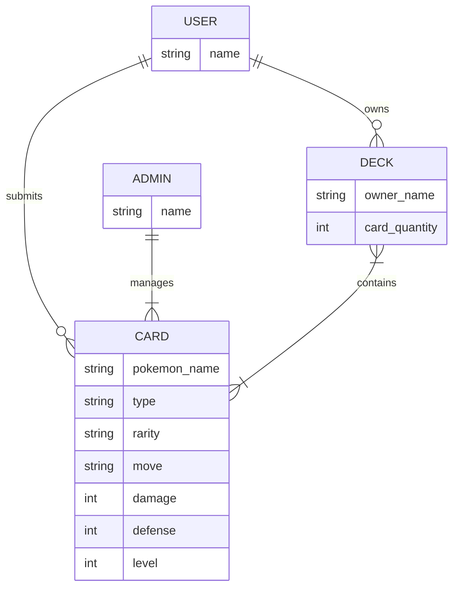

# Pokemon Card Storage Web App
---
### 1. Entity-Relationship Diagram (ERD)

```mermaid
erDiagram
USER ||--o{ DECK : owns
USER ||--o{ CARD : submits
USER {
string name
}
ADMIN ||--|{ CARD : manages
ADMIN {
string name
}
DECK }|--|{ CARD : contains
CARD {
string pokemon_name
string type
string rarity
string move
int damage
int defense
int level
}
DECK {
string owner_name
int card_quantity
}
```
