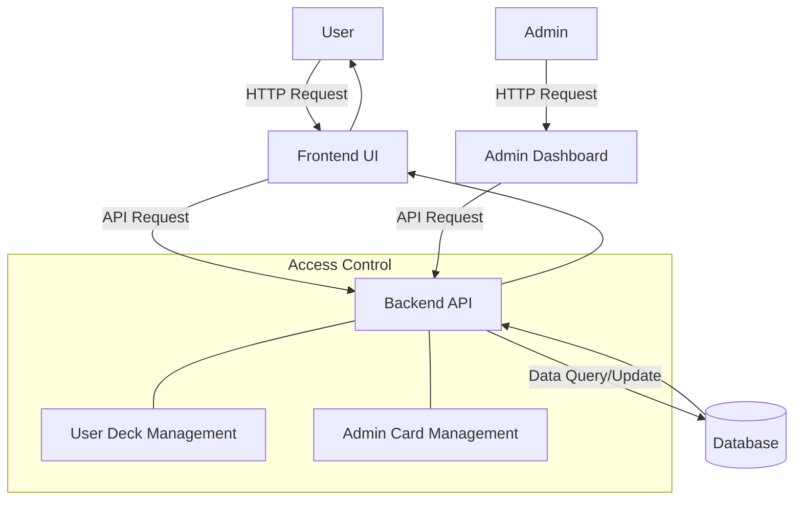

# Pokemon Card Storage Web App
## 1. Entity-Relationship Diagram (ERD)

---
## 2. User Flow Diagram

---
## 3. System Architecture Diagram

---
## 4. API Endpoints Table
```mermaid
classDiagram
class "API Endpoints" {
GET /api/cards : Fetch all cards
POST /api/cards : Submit new card (User)
PUT /api/cards/:id : Modify card (Admin)
DELETE /api/cards/:id : Delete card (Admin)
GET /api/user/decks : Fetch all decks (User)
POST /api/user/decks : Create new deck (User)
PUT /api/decks/:id : Manage deck (User)
DELETE /api/decks/:id : Delete deck (User)
GET /api/admin/cards : Fetch pending cards (Admin)
PUT /api/admin/cards/:id/approve : Approve card (Admin)
}
```
