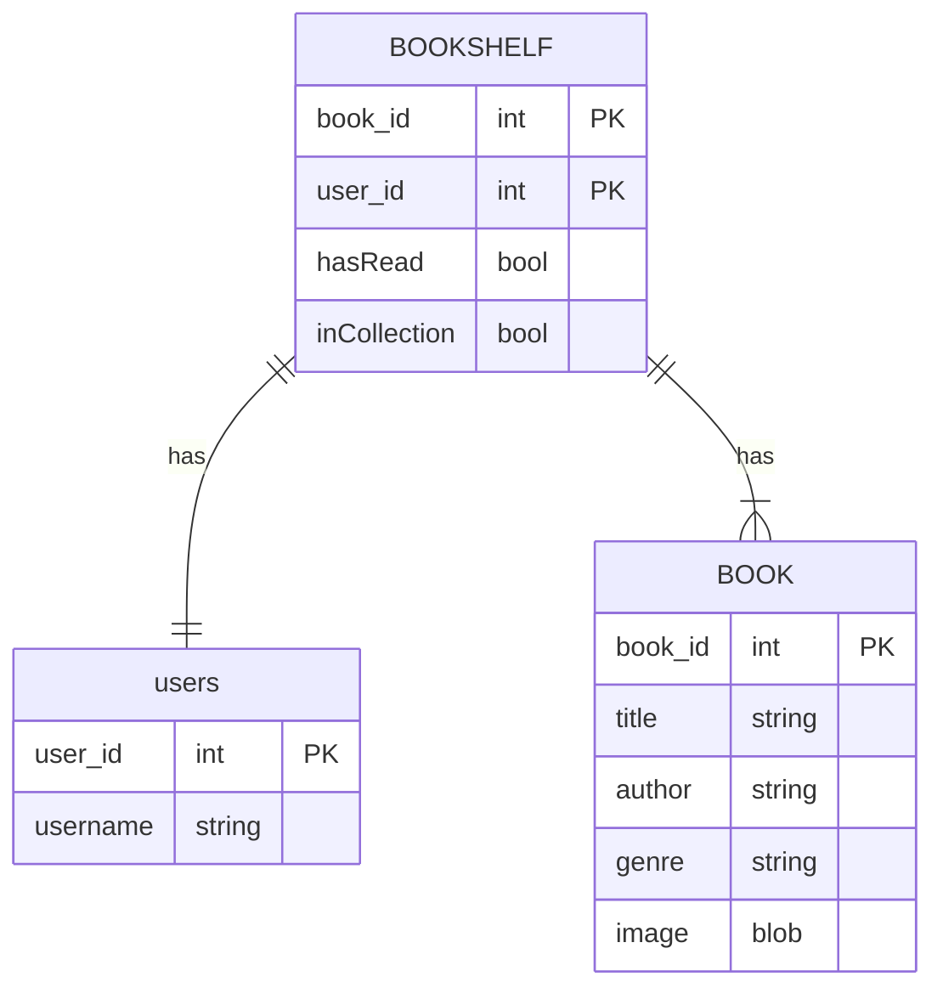
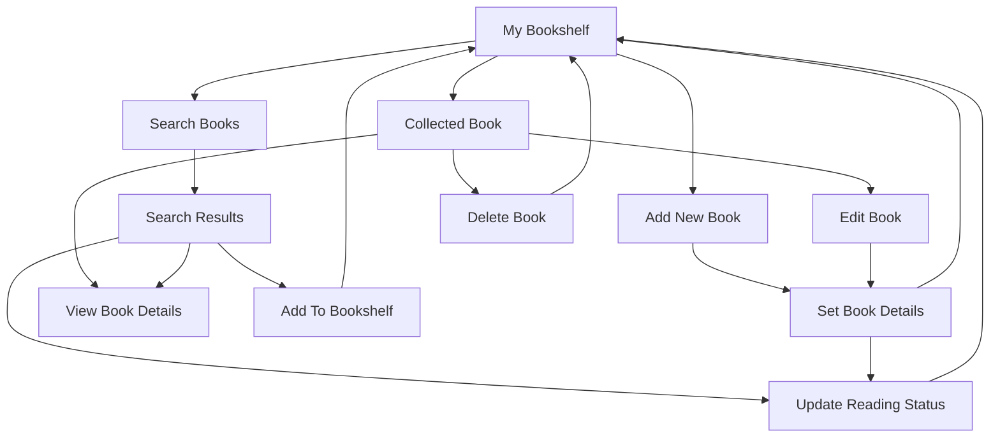

# Planning Document for Agile Architects Book Tracker App

## App Description
Stay on top of your reading progress with our intuitive app. Add books to your collection, categorize them by reading status, and view essential details like titles, authors, and descriptions. Easily search for specific books, and update your collection to reflect new reads or books you no longer own.

---
## Feature List

### Required Features:
* Include a search bar to find books by title or author
* The ability to add books from the homepage to users' bookshelves
* The ability to delete books from the users' bookshelves
* The ability to edit book details

### Should Have Features:
* The ability to favorite a book on the homepage
* Include a favorites page that displays users' favorite books
* The ability to mark books as "Have read", "Not read", or "Currently reading"

### Nice To Have Features:
* Citations included in book details
* The ability to share bookshelves with others
* Include recommended books that are displayed on the homepage
---
## User Stories

1. As a user, I want to add books to my collection, so that I can track what I own and have read.
2. As a user, I want to mark books as “Read”, “Currently Reading”,  or “To-Read” so that I can organize my reading progress.
3. As a user, I want to view details about a specific book, including its title, author, and description, so that I can remember important information about each book.
4. As a user, I want to be able to search for books by title or author, so that I can easily find books in my collection.
5. As a user, I want to edit or delete books from my collection, so that I can keep my list up to date. 

---
## Database Schema (ERD)

---
## User Flow Diagram

---
## List of Endpoints

| Method | Endpoint | Description | Authorization |
|--------|----------|-------------|---------------|
| GET    | /homepage | Display account creation and login options | Everyone |
| GET    | /homepage | Display search bar and book recommendations | User |
| POST   | /homepage/<book_id> | Add a new book to the user's bookshelf or favorites | User |
| POST   | /login | Submit login request and authenticate user using username | Everyone |
| GET    | /create_account | Display create account form | Everyone |
| POST   | /create_account | Submit new user creation request and store in database | Everyone |
| GET    | /dashboard | Display all books added by the user to their bookshelf | User |
| DELETE | /dashboard/<book_id> | Delete a book from the user's collection | User |
| GET    | /favorites | Display a page with all the user's favorite books | User |
| DELETE | /favorites/<book_id> | Delete a book from the user's favorites | User |
| PUT    | /dashboard/<book_id>/status | Update the reading status (Read, Currently Read, To-Read) | User |
| GET    | /search_books | Search for books by title or author | User |
| POST   | /search_books/<book_id>/add | Add a book from search results to the user's bookshelf | User |
| POST   | /search_books/<book_id>/favorite | Add a book from search results to the user's favorites | User |
| GET    | /book/<book_id> | Display detailed info about a specific book | User |
